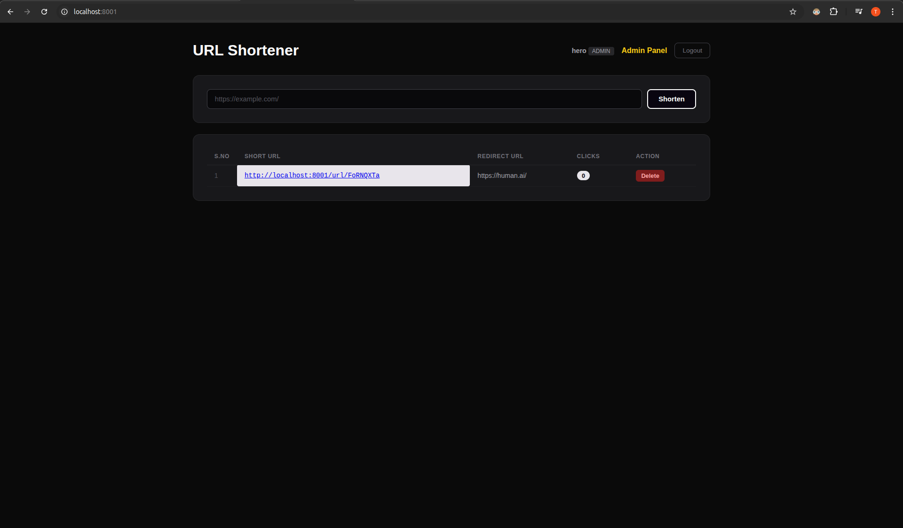
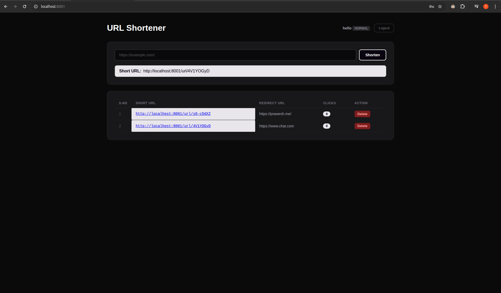
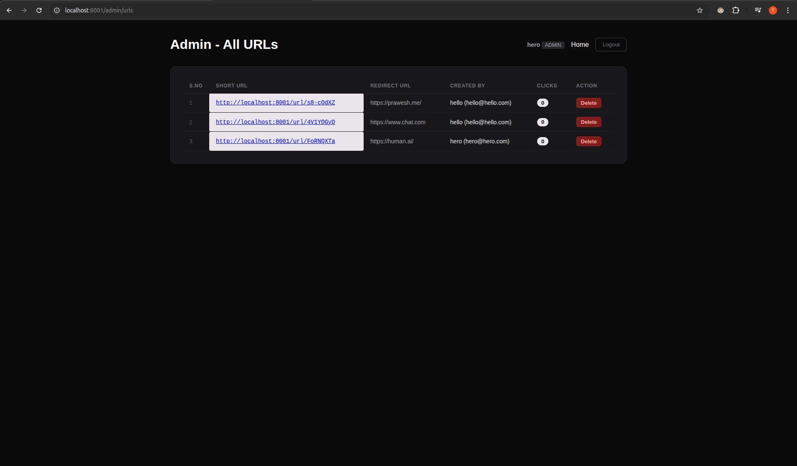

# URL Shortener (SSR)

A server side rendered (SSR) URL shortener built with **MongoDB**, **Express**, **EJS**, and **Node.js** featuring JWT based Authorization, role based access control, and an admin panel.

## Features

- **Shorten URLs** -- Generate short links with unique IDs
- **Click Tracking** -- Track how many times each short URL is visited
- **JWT Authorization** -- Token based auth via `Authorization: Bearer <token>` header
- **Role-Based Access Control** -- `NORMAL` and `ADMIN` roles
- **Admin Panel** -- View and manage all URLs from every user
- **User Dashboard** -- Each user sees and manages only their own URLs
- **Server-Side Rendering** -- Pages rendered with EJS on the server

## Screenshots

### Admin (as a user)


### Normal User


### Admin Panel


## Tech Stack

- **Runtime** -- Node.js
- **Framework** -- Express
- **Database** -- MongoDB (Mongoose)
- **Templating** -- EJS (Server Side Rendering)
- **Auth** -- JSON Web Tokens (JWT)
- **ID Generation** -- nanoid

## Getting Started

### Prerequisites

- Node.js (v18 or higher)
- MongoDB running locally on port `27017`

### Installation & Run

1. **Clone the repository**

   ```bash
   git clone https://github.com/prawesh-12/url-shortner.git
   cd url-shortner/backend
   ```

2. **Install dependencies**

   ```bash
   npm install
   ```

3. **Make sure MongoDB is running**

   ```bash
   mongosh  # verify you can connect
   ```

4. **Start the server**

   ```bash
   npm start
   ```

5. **Open in browser** -- [http://localhost:8001](http://localhost:8001)

## API Endpoints

| Method | Route | Access | Description |
|--------|-------|--------|-------------|
| POST | `/user` | Public | Sign up |
| POST | `/user/login` | Public | Login (returns JWT) |
| POST | `/url` | NORMAL, ADMIN | Create a short URL |
| GET | `/url/:shortId` | Public | Redirect to original URL |
| GET | `/url/all` | NORMAL, ADMIN | Get logged in user's URLs |
| POST | `/url/delete/:shortId` | NORMAL, ADMIN | Delete a URL |
| GET | `/url/analytics/:shortId` | NORMAL, ADMIN | Get click analytics |
| GET | `/url/admin/all` | ADMIN | Get all URLs from all users |

## Project Structure

```
backend/
├── index.js              # Express app entry point
├── connection.js         # MongoDB connection
├── controllers/
│   ├── urlHandlers.js    # URL CRUD logic
│   └── userHandler.js    # Signup & login logic
├── middlewares/
│   └── authMiddleware.js # JWT auth & role based access
├── models/
│   ├── schemaURL.js      # URL Mongoose model
│   └── schemaUsers.js    # User Mongoose model
├── routes/
│   ├── staticRouter.js   # Page routes (home, login, signup, admin)
│   ├── urlRoutes.js      # URL API routes
│   └── user.js           # User auth routes
├── services/
│   └── auth.js           # JWT sign & verify
└── views/
    ├── home.ejs          # User dashboard
    ├── login.ejs         # Login page
    ├── signup.ejs        # Signup page
    ├── admin.ejs         # Admin panel
    └── style.css         # Global styles
```

## Making a User Admin

```bash
mongosh "mongodb://127.0.0.1:27017/test-mongo-connect"
```

```js
db.users.updateOne({ email: "user@example.com" }, { $set: { role: "ADMIN" } })
```

```The user must log out and log back in for the new role to take effect.```
